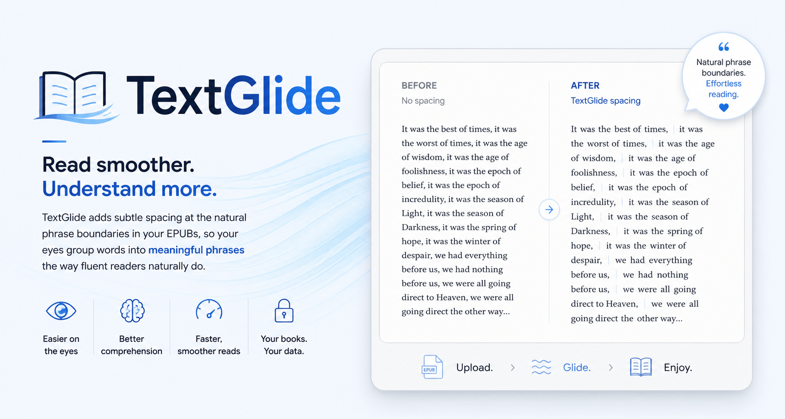

# TextGlide

**Read in phrases, not word by word.**

TextGlide is a free, open-source web app that inserts empirically-calibrated spacing at phrase boundaries inside EPUB files, then hands back a e-reader-ready EPUB. The goal is to make the natural groupings of language visible on the page, the way fluent readers' eyes already move, just without the visual cue.

[](LICENSE)
[](https://python.org)
[](https://flask.palletsprojects.com)
[](https://textglide.app)
[](https://buymeacoffee.com/avocadoattack)
[](https://ko-fi.com/avocadoattack)



---

## 🔍 What it does

Fluent readers don't process text word by word. They take in meaningful phrases per glance: the eye lands, the brain encodes the chunk, the eye moves on. For skilled readers this is automatic; for developing, non-native, or fatigued readers it often isn't, and it's the source of the gap in reading speed and comprehension.

TextGlide takes a DRM-free EPUB, parses every sentence, and inserts a fixed-width thin space (U+2009) at phrase boundaries: **inline**, not as a line-break cascade. The result is a file that reads identically on every e-reader and survives font-size changes and Kindle reflow, because it only edits whitespace. Words, markup, and layout are untouched.

## 🚀 Try it

**[textglide.app](https://textglide.app)** ➞ Free and no account required.

Upload a DRM-free EPUB, choose your reading support level, download the processed file, and sideload it onto your e-reader.

> **For best results:** set your Kindle to left-aligned (ragged-right) text. Justified text stretches normal word spaces unpredictably, which can cancel out the phrase-gap contrast. TextGlide injects a left-alignment instruction into the processed file, which has successfully overridden the Kindle justified setting in testing, but setting it manually (Settings > Reading > Alignment) is the reliable fallback.

---

## 🔬 The evidence

TextGlide's algorithm is calibrated directly against the peer-reviewed literature. Ten papers were read in full; the core finding, replicated across roughly two dozen English-language studies (Bever et al. 1992):

- **+12.7% comprehension** (subject-weighted mean across significant studies)
- **+9.9% reading speed** (subject-weighted mean across significant studies)

Roughly half the studies in the full corpus found no significant effect. The gain is real but modest. Individual variation is high. The benefit concentrates in **developing, average, and non-native readers**, and in **harder or less-familiar material**:

| Reader group | Improvement |
|---|---|
| Weak / developing readers | ~+37% (Bever et al. 1992) |
| Average readers | Significant (Jandreau & Bever 1992) |
| Strong / fluent readers | ~+6%, not statistically significant |

**The key mechanistic finding:** the gain comes from *where* the gap lands, not from extra whitespace. Jandreau & Bever (1992) tested a matched control with the same total whitespace spread evenly: it produced zero benefit. This is why TextGlide fixes the gap at one calibrated width rather than exposing it as a slider.

**Gap width:** U+2009 thin space, ~1.8x a normal word space (additive, confirmed by XHTML inspection and visual verification on Kindle Paperwhite 12 / Amazon Ember). This sits at the evidence-calibrated center: Bever et al. (1992) tested two gap magnitudes (1.75x and 2.5x) and found no significant difference between them.

Full research corpus and citations: see the References section on [textglide.app](https://textglide.app).

---

## ⚙️ Settings

### Processing mode

| Mode | What it does |
|---|---|
| **Natural Scan** *(default)* | A fast, statistical read of phrase onsets from word-pattern cues, no full grammar analysis. Mirrors the rough first-pass the eye already makes. This is the better-supported mode in the evidence: in the only direct comparison, the crude heuristic significantly outperformed the full grammar parse (Bever et al. 1992, p<.025). |
| **Grammar Parse** | A complete grammatical analysis via spaCy's dependency parser. More linguistically precise, but precision is not what the research shows helps reading. Live A/B testing (July 2026) confirmed the two modes agree on the large majority of phrase placements, directly replicating Bever et al. (1992) in production. Retained for now; consolidation into Natural Scan is planned post-MVP. |

### Reading Support

| Setting | What it does |
|---|---|
| **Balanced** *(default)* | Breaks at main phrase boundaries, keeping groups around 2-3 words. Grounded in Bever et al. (1992) phrasetree: minimum phrase length 3 words; breaks at conjunctions and prepositions. Best for everyday reading. |
| **Strong** | Finer breaks into smaller groups. Research shows this extra support especially helps developing and non-native readers, and it can help any reader tackling dense or unfamiliar material (Jandreau, Muncer & Bever 1986, Exp. 2: adding minor boundaries lifted poor readers from +16% to +20%). Live testing (July 2026) found the difference from Balanced is currently subtle on typical prose; recalibration is planned — see Roadmap. |

There is no Spacing Width control. The gap is fixed at the evidence-calibrated value (U+2009 thin space). Making it wider has no measurable effect on reading performance.

---

## 🏗️ Architecture

### Inline-only, no line breaks

Three independent papers establish why TextGlide inserts inline gaps rather than restructuring text into phrase-per-line:

- **North & Jenkins (1951):** inline spacing significantly beat line-break format on both speed and comprehension.
- **Coleman & Kim (1961):** horizontal inline spacing outperformed vertical line-break arms, which were significantly slower.
- **Keenan (1984):** one chunk per line was read significantly *more slowly* than standard text in all conditions, due to line-length variability disrupting return sweeps.

Inline spacing also survives Kindle reflow and font-size changes; a fixed line-break structure does not.

### Algorithm constants

All calibration values live in a single source-of-truth file (`textglide_config.py`), with a JavaScript mirror (`textglide_config.js`) kept in sync for the client-side reading toggle:

```python
GAP_CHARACTER           = U+2009  # THIN SPACE — ~1.8x a normal word space
                                  # Bever et al. 1992: gap magnitude above threshold
                                  # has no significant effect on readability.

GAP_CHARACTER_FALLBACK  = U+2002  # EN SPACE — not user-exposed.
                                  # Reserved for future device testing only.

BALANCED_MIN_CHARS      = 14      # ~2.5-word minimum chunk.
                                  # Bever et al. 1992: phrasetree stops at phrases
                                  # under 3 words. Jandreau & Bever 1992: confirmed.

STRONG_MIN_CHARS        = 10      # Finer chunking for developing readers / dense material.
                                  # Jandreau, Muncer & Bever 1986 Exp. 2: adding minor
                                  # boundaries lifted poor readers from +16% to +20%.

MIN_PHRASE_LENGTH       = 3       # Bever et al. 1992 phrasetree specification.

BALANCED_TRIGGERS       = [CCONJ, SCONJ, ADP]
STRONG_TRIGGERS         = [CCONJ, SCONJ, ADP, who, which, whom]
```

### Processing pipeline

1. Validate the uploaded file: `.epub` extension check, 5 MB upload cap (configurable via `MAX_UPLOAD_MB`), and Altcha PoW token verification
2. DRM guard: if `encryption.xml` or other DRM markers are present, refuse clearly
3. Unzip with decompression-bomb limits (max 1,000 entries, 10 MB per entry, 150 MB total expansion); walk each XHTML document, editing **only text nodes** — never tags, attributes, scripts, styles, or word interiors
4. Insert U+2009 at boundaries chosen by the selected mode and Reading Support setting
5. Inject `text-align: left` into the EPUB stylesheet
6. Repack into a valid EPUB, preserving all metadata and markup; if a single document fails, leave it untouched rather than corrupting the file
7. Return to user; temp files deleted immediately

---

## 🚫 What TextGlide does not do

- **Does not remove DRM.** It cannot, and it refuses to process DRM-protected files.
- **Does not change words, markup, or layout.** It edits whitespace only.
- **Does not store your books.** Files are processed in a temporary directory and deleted immediately after download.
- **Does not guarantee an improvement.** Roughly half of all studies in the research corpus found no significant effect. Your experience will vary with reading skill, material difficulty, and individual sensitivity to the cue.

---

## ⚠️ Limitations and honest caveats

- The benefit concentrates in **developing, average, and non-native readers**, and in **harder material**. For a fluent reader on easy, familiar text, expect a small comfort gain at most.
- **Justified text can cancel the effect.** Set your e-reader to left-aligned.
- The research base used **print and screen**, not Kindle specifically. The gap character has been verified on Kindle Paperwhite 12 / Amazon Ember but not exhaustively across all devices and fonts.
- **Both processing modes are currently retained.** Live A/B testing (July 2026) found Natural Scan and Grammar Parse agree on the large majority of phrase placements, confirming Bever et al. (1992) in production. Consolidation to Natural Scan only is planned post-MVP.
- Language support is currently **English and Spanish** only. Other languages require additional spaCy models and break-trigger lists calibrated to their phrase structure.

---

## 🛠️ Tech stack

| Layer | Technology | Notes |
|---|---|---|
| Backend language | Python 3.11 | |
| Web framework | Flask | |
| EPUB handling | `ebooklib` | Read/write EPUB |
| HTML parsing | `BeautifulSoup` / `bs4` + `lxml` | Safe text-node walking only |
| NLP | `spaCy` (`en_core_web_sm`, `es_core_news_sm`) | POS tags + dependency parse |
| WSGI server | `gunicorn` | 1 worker, 2 threads, `--preload` (spaCy loads at boot) |
| Bot protection | Altcha PoW (custom SHA-256 solver) | Self-contained, zero external dependency |
| Rate limiting | `Flask-Limiter` | 5 req/hr on `/api/process`, 60 req/min on `/api/preview` |
| Algorithm constants | `textglide_config.py` + `textglide_config.js` | Kept in sync; citations inline |
| Client-side engine | `naturalScan.ts` | Site-wide reading toggle |
| Frontend | React + TypeScript + Tailwind + Vite | Radix UI / shadcn components |
| Container | Docker | Multi-stage build (Node → Python) |
| Hosting | Fly.io | shared-cpu-2x, 512 MB, auto-stop |

---

## 🐳 Self-hosting

**Requirements:** Docker, a [Fly.io](https://fly.io) account, and [flyctl](https://fly.io/docs/hands-on/install-flyctl/).

```bash
git clone https://github.com/avocadoattack/TextGlide.git
cd TextGlide

# Set your Altcha HMAC secret
flyctl secrets set ALTCHA_HMAC_KEY="your-random-32-char-string"

# Deploy (--depot=false avoids intermittent registry auth issues with Fly's Depot builder)
flyctl deploy --remote-only --depot=false
```

The app runs on a shared-cpu-2x Fly.io machine (2 vCPUs, 512 MB) with auto-stop enabled. First cold start after idle takes roughly 8–12 seconds while spaCy loads the English and Spanish models; subsequent requests are fast.

Self-hosting gives you the full TextGlide experience: no rate limits and complete control over the processing pipeline. The 5 MB file-size cap is set via the `MAX_UPLOAD_MB` env var (default `5`) — raise or remove it for your own deployment, e.g. `flyctl secrets set MAX_UPLOAD_MB=50`. If you regularly work with larger EPUBs or want unrestricted throughput, self-hosting is the recommended path.

To run locally with Docker:

```bash
docker build -t textglide .
docker run -e ALTCHA_HMAC_KEY="your-secret" -e PORT=8080 -p 8080:8080 textglide
```

---

## 🗺️ Roadmap

### v1.x — Already built

- [x] ~~Natural Scan & Grammar Parse~~ — Two processing modes; Natural Scan is the evidence-aligned default
- [x] ~~Reading Support: Balanced / Strong~~ — Two density levels tied to reader skill
- [x] ~~DRM guard~~ — Refuses encrypted EPUBs with a clear message
- [x] ~~Left-alignment CSS injection~~ — Overrides Kindle justified setting on processed files
- [x] ~~Multi-language~~ — English + Spanish (`en_core_web_sm`, `es_core_news_sm`)
- [x] ~~Site-wide reading toggle~~ — Client-side Natural Scan engine on the TextGlide landing page
- [x] ~~Bot protection~~ — Altcha PoW + Flask-Limiter rate limiting
- [x] ~~Mode A/B testing~~ — All four mode/density combinations tested live; Natural Scan vs. Grammar Parse placement confirmed to largely overlap
- [x] ~~5 MB file-size cap~~ — Configurable via `MAX_UPLOAD_MB`, keeps the hosted version's costs predictable

### v1.x — Active ⏳

| Feature | Description |
|---|---|
| Streaming progress (SSE) | Replace single-response processing with Server-Sent Events so large EPUBs aren't bounded by the HTTP proxy timeout |
| Reading Support fine-tuning | Recalibrate the Strong setting's minimum character threshold to create a more pronounced difference from Balanced; reposition marketing toward ESL learners, difficult material, and personal preference |
| Processing time estimate | Show an estimated processing time based on character count before the user clicks Process, using a pre-scan endpoint (text density, not file size, is the real driver of processing time) |
| Cold-start splash screen | Static HTML shell renders instantly on page load, before React hydrates and before the Fly.io worker finishes cold-starting |
| Frontend file-size cap display | Make the dropzone's displayed limit reflect the actual backend `MAX_UPLOAD_MB` value dynamically, rather than a static "5MB" label |

### v2 — Exploratory 🔭

| Feature | Description |
|---|---|
| Mode consolidation | Retire Grammar Parse in favor of Natural Scan only, now evidence-backed by the July 2026 live A/B test; planned once the app has shipped and been publicized |
| Paste-text / `.txt` / `.html` input | Side-by-side before/after preview |
| Batch EPUB processing | Multiple files per session |
| Additional languages | French, German, Italian at minimum |
| Per-genre presets | Dense philosophy uses Strong by default; fiction uses Balanced |
| Analytics integration | Lightweight, FOSS, and privacy-respecting analytics on the website |
| Cap Standalone bot protection | Behavioral instrumentation upgrade on Fly.io, shared across future projects |
| avocadoattack.com support hub | Centralized support/donation page; unified footer support link across all avocadoattack projects |

---

## 🤝 Contributing

Contributions welcome. The highest-value open items:

- **Broader real-world reading tests.** An internal live A/B test (July 2026) across all four mode/density combinations found Natural Scan and Grammar Parse placements largely overlap, and Balanced vs. Strong differences are subtle on typical prose. More data points — different genres, reading skill levels, and material difficulty — would help validate whether that holds generally.
- **Additional language support** (French, German, Italian are natural next candidates given spaCy model availability).
- **Device verification** — if you test a processed EPUB on a Kobo, Apple Books, or any non-Kindle device and can report whether the thin space renders visibly, that is directly useful data.
- **Bug reports** on DRM detection, EPUB structure edge cases, or processing failures.

Before proposing a change to the algorithm constants, please read the [algorithm change rule](CONTRIBUTING.md): every constant must be tied to a peer-reviewed citation. Please open an issue before starting significant work so we can discuss scope and direction.

See [CONTRIBUTING.md](CONTRIBUTING.md) for the full process.

---

## 📬 Contact

Open a thread in [GitHub Discussions](https://github.com/avocadoattack/TextGlide/discussions) for questions, feedback, or ideas.

---

## 💰 Costs

Running TextGlide isn't free. Here's the actual cost breakdown, shared for full transparency:

| Item | Cost |
|---|---|
| Domain (textglide.app) | $15 / year |
| Hosting (Fly.io) | ~$5 / month (TBD) |
| Replit Agent (one-time build cost) | $45 |
| **Total for launch year (2026)** | **$120** |
| **Total ongoing (per year)** | **$75** |

If TextGlide has been useful to you, consider chipping in:

[](https://buymeacoffee.com/avocadoattack)
[](https://ko-fi.com/avocadoattack)

---

## 🙏 Acknowledgments

TextGlide is inspired by Asym, a phrase-spacing tool from Asymmetrica Labs. With Asym no longer available, TextGlide was developed independently as an open-source project based on scientific research, not Asym's code or content.

This project stands on decades of careful reading science. Researchers such as North & Jenkins, Coleman & Kim, Mason & Kendall, Keenan, Lefton, Negin, Magloire, Jandreau, Muncer, Bever, and others in the reading-science and psycholinguistics community built the evidence base that made TextGlide possible. Any value in this tool comes from their efforts.

The scientific foundation for TextGlide traces back to North & Jenkins (1951) and subsequent work through the 1990s. Research shows that phrase-sensitive spacing aids reading by leveraging perceptual mechanisms, particularly for readers who have not yet automated phrase-grouping.

---

## 📄 License

Apache 2.0 — see [LICENSE](LICENSE).

The name **TextGlide** is not licensed under Apache 2.0. Use of the name in derived works or products requires prior written permission from the maintainer.